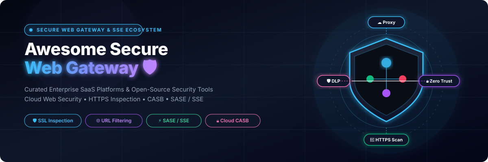

# 🚀 Awesome Secure Web Gateway (SWG)

  
  
  
  
  

  

## 📌 Top Secure Web Gateway (SWG) & SSE Ecosystem

> **A curated, enterprise-ready list of commercial SaaS platforms & open-source GitHub projects for Secure Web Gateway (SWG), Cloud Web Filtering, HTTPS Interception, URL Filtering, Malware Defense & SASE/SSE Architecture.**  
> 
> *Last updated: September 2026* 📅

---

### 💡 Overview & Market Context

**Secure Web Gateways (SWG)** and **Security Service Edge (SSE)** solutions inspect outbound web traffic, enforce acceptable-use policies, decrypt and scan HTTPS/TLS traffic, block malicious destinations, prevent Data Loss (DLP), and protect users whether on-network or remote.

- **Commercial SaaS Platforms**: Offer global Points of Presence (PoPs), multi-gigabit SSL inspection, real-time threat intelligence feeds, zero-trust network access (ZTNA), CASB, and 24/7 SLA guarantees (*Cisco*, *Cloudflare*, *Zscaler*, *Netskope*, *Cato*).
- **Open-Source Solutions**: Provide flexible, self-hosted proxies (**Caddy**, **Pi-hole**, **mitmproxy**, **AdGuard Home**, **Squid**, **e2guardian**) for private cloud or on-premises web security and URL filtering.

---

## 📑 Table of Contents

- [💼 SaaS / Hosted Platforms](#-saas--hosted-platforms)
- [🔓 Open-Source GitHub Projects](#-open-source-github-projects)
- [📈 Star History](#-star-history)
- [🤝 How to Contribute](#-how-to-contribute)
- [⚠️ Disclaimer](#%EF%B8%8F-disclaimer)

---

## 💼 SaaS / Hosted Platforms

> 📊 **Market Insights**: The global Secure Web Gateway (SWG) & Security Service Edge (SSE) market is estimated at **$9.5B–$11.2B USD** (projected to exceed **$25B+ by 2030** at ~18–20% CAGR). Market concentration is **moderately concentrated**, dominated by market leaders (*Cisco*, *Cloudflare*, *Zscaler*, *Netskope*) while converged SASE providers (*Cato*, *Versa*) rapidly capture market share.

*Note: The table below is sorted by **Company Size / Valuation (Descending)**.* ⬇️

| Platform / Product | Description | Starting Pricing 💵 | Free Tier / Trial Limit 🎁 | Company Size / Valuation 🏢 |
| :--- | :--- | :--- | :--- | :--- |
| **[Cisco Umbrella](https://umbrella.cisco.com/)** 🌐 | DNS-layer security and cloud SWG providing first-line protection, full proxy capabilities, and integration with Cisco Secure Access. | **$2.20 / user / month** ($26.40 / user / year starting for DNS Security Essentials) | **14-day free trial** (up to 21-day trial available via MSP partner program) | **~$57B+ Annual Revenue** / ~$200B+ Market Cap *(Public - NASDAQ: CSCO)* |
| **[Cloudflare Gateway](https://www.cloudflare.com/products/zero-trust/gateway/)** ⚡ | Secure web gateway delivered on Cloudflare’s global edge network, offering DNS filtering, HTTP/S inspection, and Zero Trust policy enforcement. | **$7 / user / month** (Pay-as-you-go tier, billed annually) | **Free forever** for up to **50 users** (24-hr log retention, 3 physical locations, max 150k DNS queries/seat/mo) | **~$1.7B+ Annual Revenue** / ~$35B+ Market Cap *(Public - NYSE: NET)* |
| **[Zscaler Internet Access (ZIA)](https://www.zscaler.com/products/zscaler-internet-access)** 🛡️ | Cloud-native Secure Web Gateway delivering scalable SSL inspection, threat protection, and policy enforcement from a global security cloud. | **$8 / user / month** ($72 / user / year entry ZIA tier) | **30-day free trial** (Proof of Concept / evaluation program for modules like Advanced Cloud Sandbox) | **~$2.5B+ Annual Revenue** / ~$30B+ Market Cap *(Public - NASDAQ: ZS)* |
| **[Netskope SWG](https://www.netskope.com/)** 🚀 | Cloud SWG tightly integrated with Netskope’s SSE/SASE platform, strong in data protection (DLP), CASB context, and threat defense. | **$4 / user / month** ($48 / user / year starting tier for base SWG + CASB bundle) | **30-day free trial** (evaluation / PoC trial period; 14-day test drive for Netskope Private Access) | **~$500M+ ARR** / ~$3B+ Valuation *(Private)* |
| **[Cato Networks](https://www.catonetworks.com/)** 🏰 | Converged SASE platform offering cloud-native SWG, FWaaS, and ZTNA across a global private backbone. | **$6 / user / month** ($72 / user / year starting per-user tier) | **30-day free trial** (PoC evaluation license; includes simulated read-only Demo Mode) | **~$200M+ ARR** / ~$3B+ Valuation *(Private)* |
| **[Forcepoint ONE](https://www.forcepoint.com/)** 🔒 | Cloud security platform providing SWG capabilities alongside Data Loss Prevention (DLP) and data-centric Zero Trust controls. | **$4.58 / user / month** ($55 / user / year starting tier for Web Security Edition) | **30-day free trial** (custom evaluation / PoC available upon request) | **~$400M+ Annual Revenue** / ~$2B+ Valuation *(Private Equity - Francisco Partners)* |
| **[Skyhigh Security](https://www.skyhighsecurity.com/)** ☁️ | Cloud SWG and SSE platform focused on web security, remote user protection, and inline data loss prevention. | **$5 / user / month** ($60 / user / year starting tier for SSE Essentials) | **1-day guided lab trial** (interactive hands-on workshops & temporary PoC accounts) | **~$150M+ ARR** / ~$1B+ Estimated Valuation *(Private Equity - STG)* |
| **[Versa Secure Internet Access](https://www.versa-networks.com/)** 📡 | SASE platform including Secure Web Gateway functionality as part of a converged networking and security service. | **$7.50 / user / month** ($90 / user / year starting tier for VSIA Essential) | **90-day free trial** (up to 100 users for qualifying enterprise accounts) | **~$100M+ ARR** / ~$1B+ Valuation *(Private)* |
| **[Lookout Secure Web Gateway](https://www.lookout.com/)** 📱 | Cloud SWG with integrated mobile endpoint security, CASB context, and advanced malware protection. | **$5 / user / month** ($60 / user / year starting tier for enterprise web/mobile security) | **90-day free trial** (for enterprise mobile and web security evaluation) | **~$100M+ ARR** / ~$1B+ Valuation *(Private)* |
| **[iboss](https://www.iboss.com/)** 🔐 | Cloud SWG and SSE platform focused on web security, containerized architecture, remote user protection, and threat prevention. | **$6 / user / month** ($72 / user / year starting tier for Zero Trust Core package) | **14-day free trial** (Proof of Concept access available upon request) | **~$100M+ ARR** / ~$500M+ Estimated Valuation *(Private)* |

---

## 🔓 Open-Source GitHub Projects

> **Open-Source Advantage**: Self-hosted, free, and community-driven proxies, DNS blocklists, TLS interception tools, content filters, and ICAP security engines.

*Note: Repositories below are sorted by **GitHub Star Count (Descending)**.* ⬇️

1. **[Caddy](https://github.com/caddyserver/caddy)**  🔒  
   Enterprise open-source web server, reverse proxy, and gateway with automatic HTTPS, TLS interception, and extensible plugin architecture for web security enforcement.

2. **[Pi-hole](https://github.com/pi-hole/pi-hole)**  🛡️  
   Network-wide DNS sinkhole and ad/malware domain filter. Provides lightweight first-layer DNS security for on-premises networks and remote VPN clients.

3. **[mitmproxy](https://github.com/mitmproxy/mitmproxy)**  🔍  
   Interactive SSL/TLS-capable intercepting HTTP proxy for security research, HTTPS traffic inspection, payload auditing, and custom filtering scripts.

4. **[AdGuard Home](https://github.com/AdguardTeam/AdGuardHome)**  🏠  
   Network-wide DNS filtering server for blocking tracking, phishing, and adult content with encrypted DNS support (DoH, DoT, DoQ) and parental control web UI.

5. **[Envoy Proxy](https://github.com/envoyproxy/envoy)**  🚀  
   High-performance L7 proxy and cloud-native communication bus used in modern Zero Trust edge gateways, service meshes, and custom API/web security stacks.

6. **[HAProxy](https://github.com/haproxy/haproxy)**  ⚡  
   Reliable, high-performance TCP/HTTP load balancer and proxy server used for high-availability web filtering frontends and SSL/TLS termination.

7. **[ClamAV](https://github.com/Cisco-Talos/clamav)**  🦠  
   Open-source antivirus engine for detecting trojans, viruses, and malware. Standard backend integrated via ICAP with Squid and web filtering proxies.

8. **[Squid](https://github.com/squid-cache/squid)**  🦑  
   The classic caching and forwarding proxy supporting SSL/TLS Bumping for HTTPS inspection. Forms the foundation of most self-hosted secure web gateway deployments.

9. **[Privoxy](https://github.com/privoxy/privoxy)**  🔐  
   Non-caching web proxy with advanced filtering capabilities, HTTP header manipulation, access control, and privacy enhancement for web traffic.

10. **[e2guardian](https://github.com/e2guardian/e2guardian)**  🎯  
    Leading open-source web content filter working with Squid (or ICAP). Features URL filtering, content phrase matching, HTTPS MITM inspection, and virus scanner integration.

11. **[Web Safety for Squid](https://github.com/diladele/websafety)**  🖥️  
    Secure web gateway and administrative web UI built around Squid. Adds category-based filtering, ICAP antivirus scanning, ad blocking, and policy controls.

12. **[c-icap Server](https://github.com/c-icap/c-icap)**  ⚙️  
    Implementation of an ICAP (Internet Content Adaptation Protocol) server used to interface HTTP proxies (Squid) with antivirus engines (ClamAV) and content filters.

---

### 🛠️ Additional Open-Source Frameworks & Components

- **TLS Interception Tooling**: Certificate authority management utilities and PKI scripts for issuing organizational root CAs used in HTTPS MITM inspection.
- **Category & Reputation Lists**: Open-source domain and URL blocklists (StevenBlack, UT1 Toulouse, OISD) integrable into e2guardian, Squid, and Pi-hole.
- **Containerized Proxy Deployments**: Docker Compose and Kubernetes Helm charts for deploying Squid + e2guardian + ClamAV ICAP stacks.
- **Authentication Integrations**: LDAP, Active Directory, Kerberos, and OAuth2/OIDC captive-portal connectors for proxy identity verification.
- **Telemetry & Monitoring**: Prometheus exporters and log pipelines (Fluentd, Grafana Loki) for proxy health metrics and threat analytics.

---

## 📈 Star History

---

## 🤝 How to Contribute

Contributions are welcome! Please follow these simple steps:

1. 🍴 Fork the repository.
2. 📝 Add or update entries in `README.md` following the existing tabular or badged list format.
3. 🔗 Ensure all links lead to official sites or valid GitHub stargazers pages.
4. 🚀 Submit a Pull Request (PR) with a brief description of your additions.

Check out [Awesome List Collection](https://github.com/ishandutta2007/Awesome-Awesome-Awesome) for more awesome resources! ⭐

---

## ⚠️ Disclaimer

- This repository is a **community-curated list** provided for informational and educational purposes.
- Secure Web Gateways perform TLS interception and traffic inspection. Deployment requires careful legal, privacy, certificate distribution, and compliance management.
- Self-hosted open-source proxy and filtering stacks demand ongoing maintenance, security hardening, and threat intelligence updates. Operators remain responsible for the reliability and security of any self-hosted deployment.

---

  <b>Made with ❤️ for Network Security Engineers, SASE/SSE Architects, IT Administrators & Privacy Engineers.</b>

